# Splunk Brute-Force Detection Lab (Windows + Kali)

This project demonstrates a Blue Team SIEM workflow using Splunk:
- Collect Windows Security logs using Splunk Universal Forwarder
- Simulate failed network logons from a Kali attacker
- Detect brute-force behavior using Splunk SPL
- Trigger a Splunk alert when repeated failed logons occur from the same source IP

---

## Lab Architecture

Kali (Attacker) ➜ Windows 10 (Victim) ➜ Splunk Enterprise (Ubuntu SIEM)

- Splunk Server: Ubuntu (Splunk Enterprise)
- Log Source: Windows 10 (Windows Security Event Logs)
- Attacker: Kali Linux (SMB authentication attempts)

---

## What I Built

- Splunk receives Windows Security logs in `index=main`  
- Kali generates failed network logons against Windows  
- Windows logs EventCode **4625 (Failed Logon)** with **Logon_Type = 3 (Network Logon)**  
- Splunk detection aggregates failures by attacker IP  
- Splunk alert triggers when the threshold is met  

---

## Key Detection Logic (SPL)

### Confirm failed network logons (4625, Logon_Type=3)
````markdown
```spl
index=main source="WinEventLog:Security" EventCode=4625 Logon_Type=3
```

## Project Evidence (Screenshots)

### 1. Splunk server running and receiving connections


### 2. Windows Splunk Universal Forwarder service running
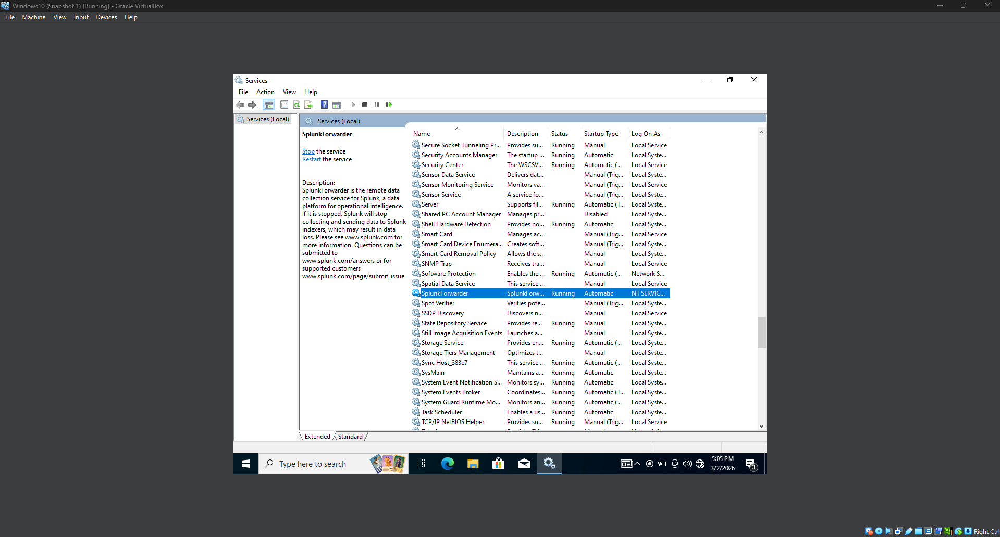

### 3. Windows Forwarder configured to send logs to Splunk
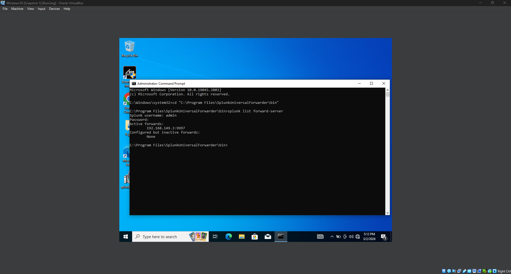

### 4. inputs.conf configured to collect Windows Event Logs
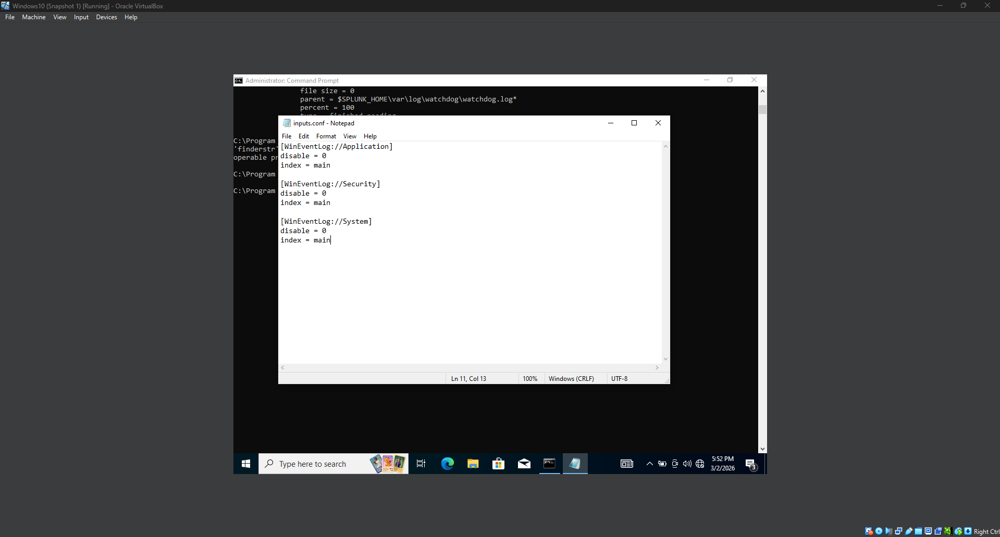

### 5. Forwarder restarted after configuration
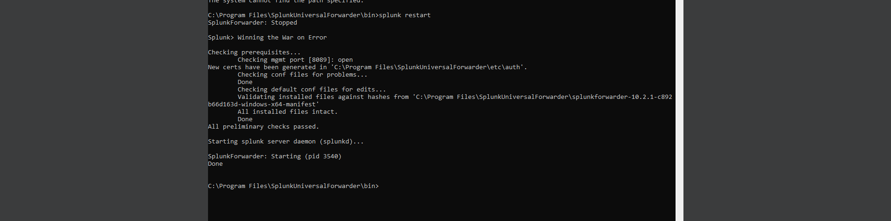

### 6. Windows logs successfully appearing in Splunk
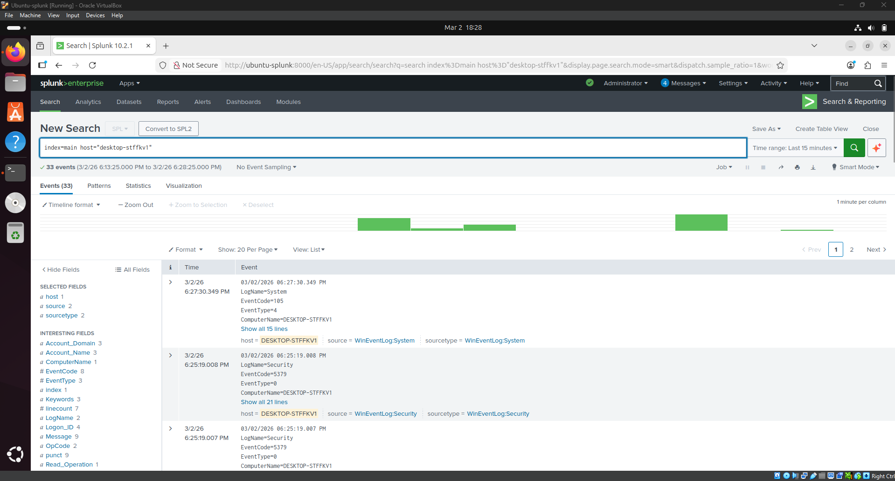

### 7. Splunk showing available log sources
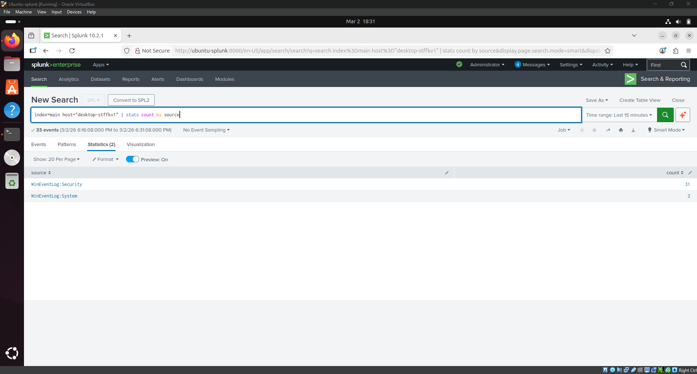

### 8. Search for failed login events
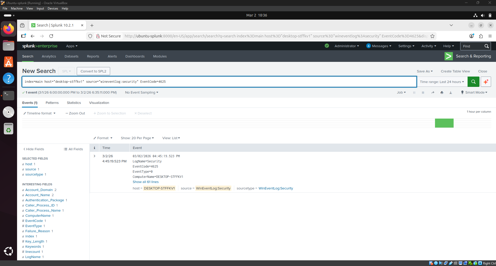

### 9. Count of failed login attempts per user
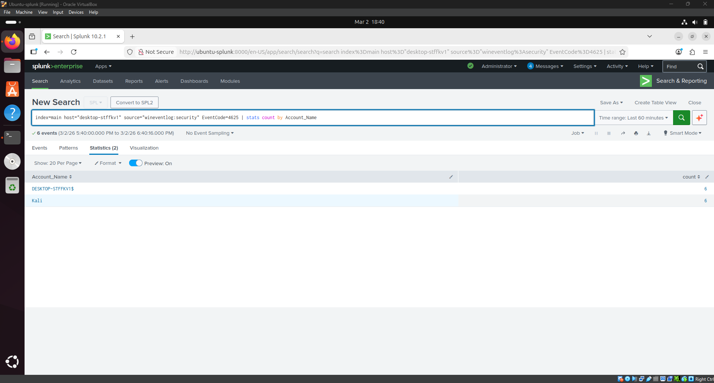

### 10. Kali attacker IP detected in Splunk logs
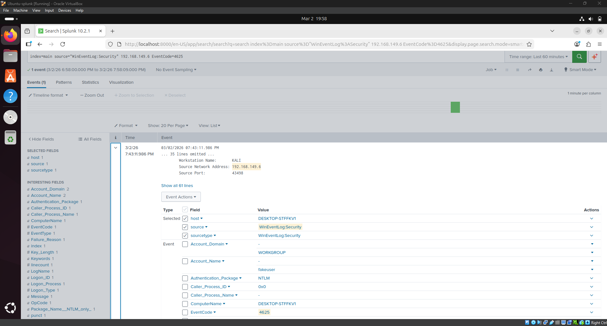

### 11. Windows network profile changed to private
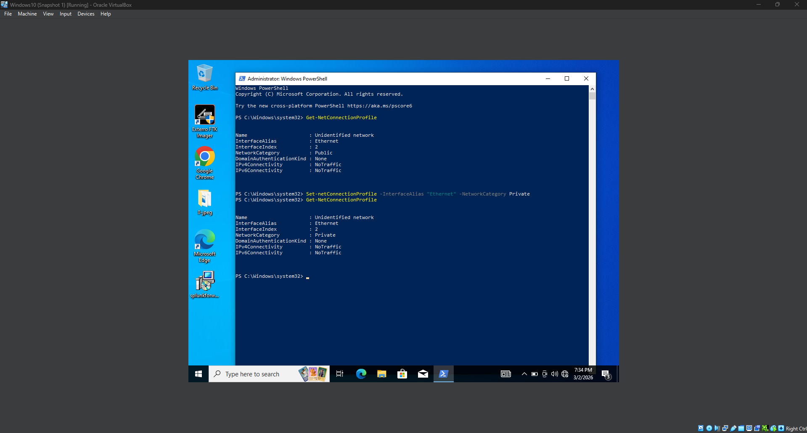

### 12. Brute force detection triggered
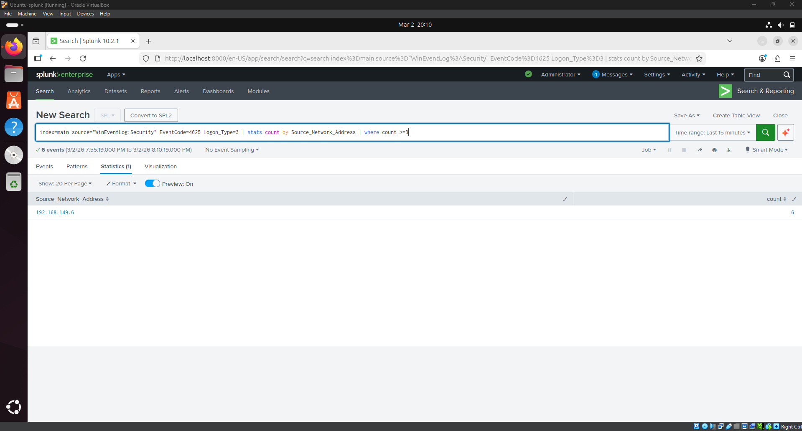

### 13. Splunk alert configuration
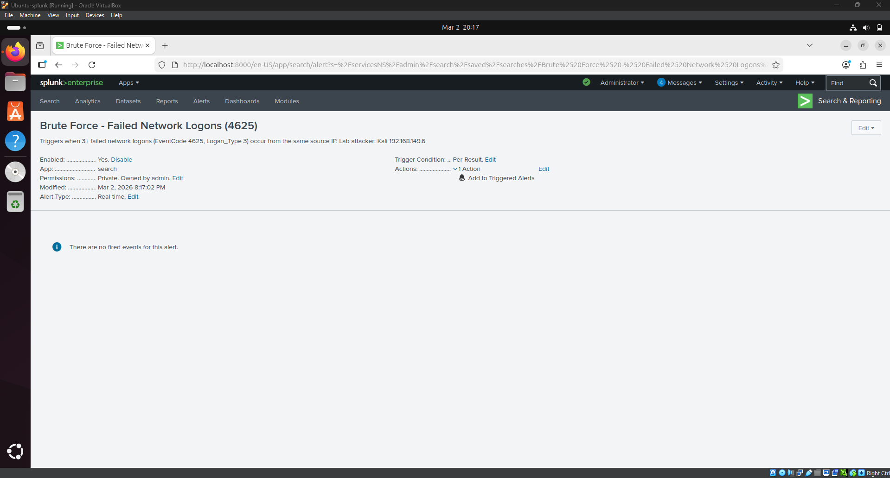

### 14. Multiple failed login attempts generated
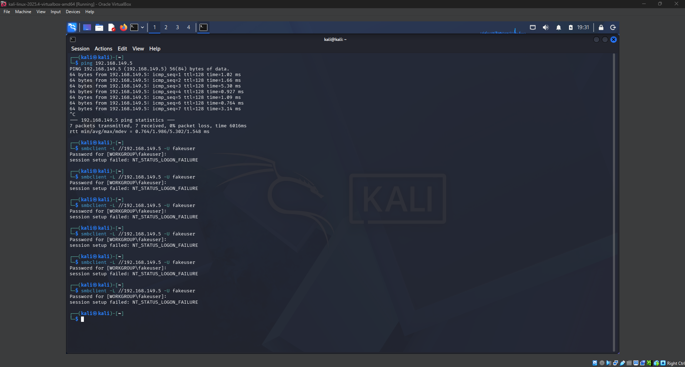

### 15. Final brute force detection query result


### 16. Splunk alert triggered proof
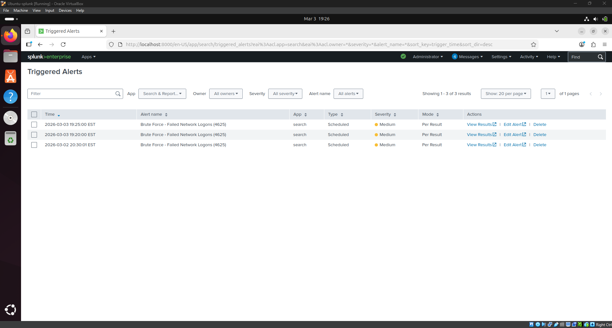
